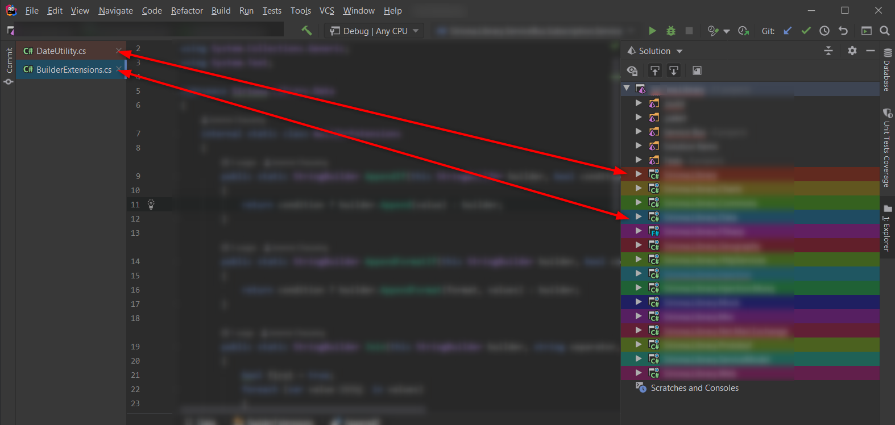

# RiderAutocolor

## About

This program modifies the JetBrains Rider solution configuration file (workspace.xml) to display each project of a different color.

Inspiration from Visual Studio's [Custom Document Well](https://marketplace.visualstudio.com/items?itemName=VisualStudioPlatformTeam.CustomDocumentWell) extension.

## Screenshot

## Usage

Normal usage :

    dotnet run -- --sln-path "PATH_TO_SLN_FILE"

Show help :

    dotnet run -- --help

## Example

    dotnet run -- --sln-path "D:\GIT\Main.Library\Library.sln"
